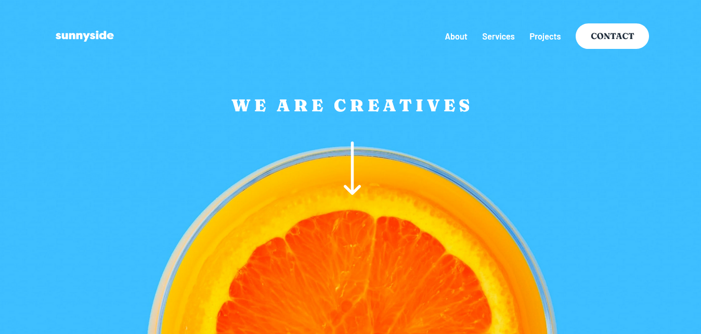

# Frontend Mentor - Sunnyside agency landing page solution

This is a solution to the [Sunnyside agency landing page challenge on Frontend Mentor](https://www.frontendmentor.io/challenges/sunnyside-agency-landing-page-7yVs3B6ef). Frontend Mentor challenges help you improve your coding skills by building realistic projects.

## Table of contents

- [Overview](#overview)
  - [The challenge](#the-challenge)
  - [Screenshot](#screenshot)
  - [Links](#links)
- [My process](#my-process)
  - [Built with](#built-with)
  - [What I learned](#what-i-learned)
  - [Continued development](#continued-development)
  - [Useful resources](#useful-resources)
- [Author](#author)

## Overview

### The challenge

Users should be able to:

- View the optimal layout for the site depending on their device's screen size
- See hover states for all interactive elements on the page

### Screenshot



### Links

- Solution URL: [Solution on Frontend Mentor](https://www.frontendmentor.io/solutions/responsive-sunnyside-agency-landing-page-css-flexbox-and-grid-4ItVM-uwW)
- Live Site URL: [Take a look at my page here](https://dinadess.github.io/sunnyside-agency-fm/)

## My process

### Built with

- Semantic HTML5 markup
- CSS custom properties
- Flexbox
- CSS Grid
- Mobile-first workflow
- Some JS for the navigation on mobile screens

### What I learned

- How to handle Responsive Images from HTML code by using srcset and sizes attributes on the img element. [Here is a link to MDN where I found the article](https://developer.mozilla.org/en-US/docs/Learn/HTML/Multimedia_and_embedding/Responsive_images)

Down below, is a code portion I wrote using the srcset and sizes attributes:

```html

```

### Continued development

I'll keep reading about the srcset ans sizes attributes to get more confident in using them.

### Useful resources

-[MDN - Responsive Images](https://developer.mozilla.org/en-US/docs/Learn/HTML/Multimedia_and_embedding/Responsive_images) - It is used to optimize the website loading when previewed on a mobile screen and to load the right image according to the size of the user's device.

## Author

- Frontend Mentor - [@dinadess](https://www.frontendmentor.io/profile/dinaDess)
